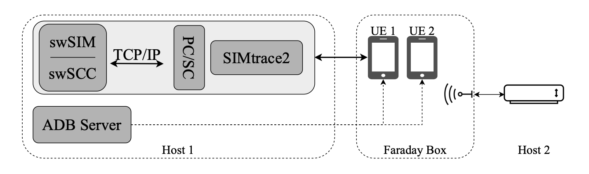

# Physical UE with SIMurai

This setup shows that SIMurai can function as a SIM replacement for commercial smartphones. In our paper, this corresponds to `Setup 1: Physical UE in 2G/4G/5G Networks` in Section `6.1 Integration into Cellular Test Beds`.

Here, we connect two smartphones to a 2G Yate network. One of the smartphones is using SIMurai as its SIM. Launching this setup will show that SIMurai is compatible with commercial, off-the-shelf smartphones. Further, it provides the basis for experiment E1 ([`2__experiment/1__spyware`](../../2__experiment/1__spyware/README.md)), that extends SIMurai with SIM-based spyware.

## Requirements

This setup requires physical hardware, and an exact replication our physical setup. If the required hardware is unavailable, we suggest to try setup 2 first, `../2__srsue` since it uses a *virtualized* cellular network that does not rely on any hardware.

## Setup



This setup requires physical hardware:
- Two host computers.
- Two smartphones (UE1, UE2).
- A faraday box.
- BladeRF Software-Defined Radio for YateBTS.
- SIMtrace2 and SIM adapter cables that fit the two smartphones.

As such, our scripts cannot automate everything, and manual efforts are required:
- Set up both smartphones for use with `adb` by authorizing our host for debug access.
- Set up UE 1 with SIMurai, using the SIMtrace2 adapter board.
- Set up a physical SIM card for UE 2.

## Building and Running the Setup

We offer three ways of running setup 1:
1. **Local setup:** We have all hardware attached to the current (local) machine, and we want to run the 2G Yate network, SIMtrace2 host software, PCSC daemon, and SIMurai all on this one machine.
2. **Remote setup:** We have a remote setup that is already setup and running and we only want to inspect the phones remotely using `scrcpy`.
3. **Hybrid setup:** In this case we are running in the same way as for the local setup but *without* installing and running the network components (Yate and BladeRF).

### Installing
The install script takes a single command line argument:
- (Mandatory) Argument 1:
  - `0` for a **local setup**.
  - `1` for a **remote setup**.
  - `2` for a **hybrid setup**.

For a local setup:
```bash
./1__install.sh 0;
```

For a remote setup:
```bash
./1__install.sh 1;
```

For a hybrid setup:
```bash
./1__install.sh 2;
```

### Running

The run script takes a number of command line arguments to configure certain aspects of how the setup is ran:
- (Mandatory) Argument 1:
  - `0` for a **local setup**.
  - `1` for a **remote setup**.
  - `2` for a **hybrid setup**.
- (Optional) Argument 2:
  - `0` to flash the SIMtrace2 device with the cardem firmware.
  - `1` to not flash the firmware. This is the default to minimize degradation of the flash storage on the SIMtrace2 but installing the firmware is **mandatory** for the setup to work.
- (Optional) Argument 3:
  - `0` to flash BladeRF firmware with a known-to-work version. Try this if Yate does not detect the BladeRF.
  - `1` to not flash the firmware. This is the default value to not degrade the flash on the BladeRF device.
- (Optional) Argument 4:
  - `0` to load the FPGA with a known-to-work bitstream. This is the default value as loading the bitstream does not degrade the BladeRF and this is important for the radio to work well with the versions of BladeRF components we compiled and installed.
  - `1` to not load the FPGA bitstream.

To run the setup locally:
```bash
./2__run.sh 0 0 0 0;
```
Please note that running this command multiple times *will* degrade the flash chips on both the SIMtrace2 and BladeRF so please read the description of arguments above to adjust the commandline arguments.

All subsequent runs of the setup can be done with:
```bash
./2__run.sh 0;
```

When the setup is running on a remote machine, please run this setup with:
```bash
./2__run.sh 1;
```
This will provide instruction on using `scrcpy` to connect to phones connected to the remote host.

### Interpretation of Results

Once the phones connect to the network, they will receive messages notifying them about phone numbers they have been assigned. To check that the phones are indeed connected and working, you could send an SMS, or call from one phone to the other.

UE1 on the bottom left screen and in `log/simtrace2.log` you will be able to see the output of the SIMtrace2 device, i.e., the trace of all messages exchanged between SIMurai and the phone.
The phone will exchange many messages with SIMurai before connecting to the network, and once it does, it demonstrates that SIMurai can act as a regular SIM card in a commercial phone.

SIMurai also comes with a proactive application which means that UE1 will show a "SIM toolkit" application that allows interaction with the proactive app on the SIM. Some features are to open a web browser, or display text. The SIM card inside UE2 does not have a proactive application, therefore the "SIM toolkit" app will not show up.
