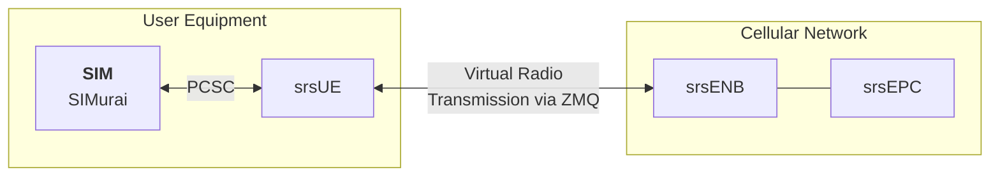
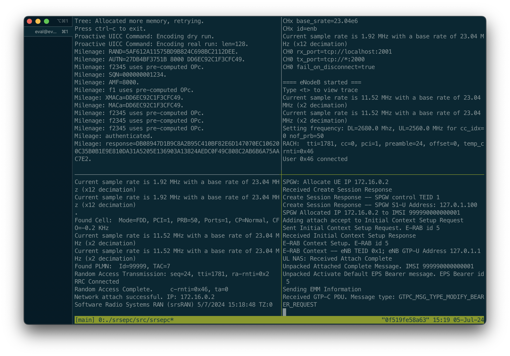

# Virtual srsRAN network with SIMurai

This setup launches a virtual, end-to-end 4G cellular network using the srsRAN project, and integrates SIMurai into the UE component srsUE. In our paper, this corresponds to `Setup 2: Emulated, SRS-based Network.` in Section `6.1 Integration into Cellular Test Beds`.

## Setup



## Requirements

The setup is fully virtualized and requires no special hardware. Please refer to the general requirements in the [top-level README](../../README.md).

## Building and Running the Experiment

First, build the Docker containers. This takes a couple of minutes for compiling the whole srsRAN codebase.

```
./1__install.sh
```

Then, run the setup:

```
./2__run.sh
```

This will spawn a tmux instance that shows terminals for each of the four network components, SIMurai, srsUE, srsENB, and srsEPC. The radio layer takes a few seconds to initialize, and eventually, srsUE will find the virtual radio cell and connect.



### Interpretation of Results

Our experiment shows that srsUE can successfully authenticate using SIMurai. Log files for all components are saved in the `log/` directory. The general connection and authentication procedure runs as follows.

1. srsUE: initializes the connection to the network.
2. srsEPC: sends an Authentication Request to srsUE. The message contents (visible in `log/srsepc.pcap`):

```
Non-Access-Stratum (NAS)PDU
    0000 .... = Security header type: Plain NAS message, not security protected (0)
    .... 0111 = Protocol discriminator: EPS mobility management messages (0x7)
    NAS EPS Mobility Management Message Type: Authentication request (0x52)
    0000 .... = Spare half octet: 0
    .... 0... = Type of security context flag (TSC): Native security context (for KSIasme or KSIamf)
    .... .000 = NAS key set identifier:  (0) ASME
    Authentication Parameter RAND - EPS challenge
        RAND value: a6fae21c6015b84205e9d9fa374143c6
    Authentication Parameter AUTN (UMTS and EPS authentication challenge) - EPS challenge
        Length: 16
        AUTN value: a7cc1ceeb2b780006f626d620a4363fe
            SQN xor AK: a7cc1ceeb2b7
            AMF: 8000
            MAC: 6f626d620a4363fe
```

3. The Authentication Request is handed to the SIM card, in our case, SIMurai. In `log/simurai.log` you can see the exact Authentication Request being processed by SIMurai:

```
Milenage: RAND=A6FAE21C6015B84205E9D9FA374143C6.
Milenage: AUTN=A7CC1CEEB2B7 8000 6F626D620A4363FE.
…
Mileage: authenticated.
Mileage: response=DB085CABE981300C4A3C106C8BB7F90AA1FA6A9CB2E99AF38CB25E102AF1B828CDD575253457D652F8AA2F5008EE9F3019CC521241.
```

4. srsUE sends the SIM Authentication response back to the network:
```
Non-Access-Stratum (NAS)PDU
    0000 .... = Security header type: Plain NAS message, not security protected (0)
    .... 0111 = Protocol discriminator: EPS mobility management messages (0x7)
    NAS EPS Mobility Management Message Type: Authentication response (0x53)
    Authentication response parameter
        Length: 8
        RES: 5cabe981300c4a3c
```

5. The network accepts the authentication and proceeds with Security Mode Command; otherwise, an "Authentication Reject" message would occur.