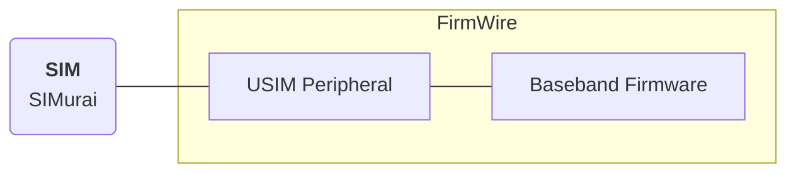
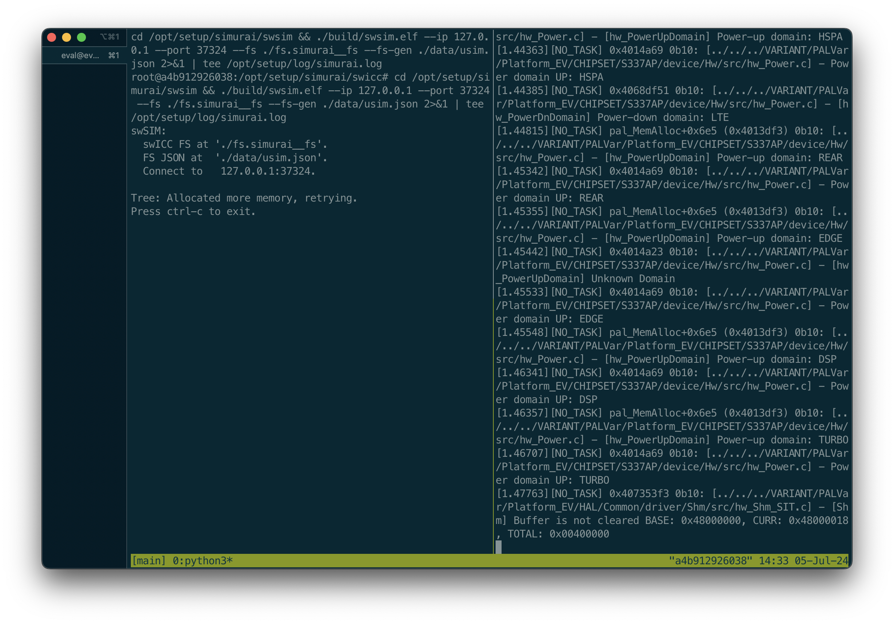

# FirmWire-Emulated UE with SIMurai

This setup uses the FirmWire rehosting platform to boot a baseband firmware. We use SIMurai to provide the baseband firmware with a working SIM, and thereby take the baseband initialization further. In our paper, this corresponds to `Setup 3: Emulation platform` in Section `6.1 Integration into Cellular Test Beds`.

## Setup



The USIM Peripheral effectively provides the functionality of a card reader (which of course is not present within the baseband firmware image). 

## Requirements

This setup is fully virtualized. It works with the following requirements:

- Ubuntu 22.04
- x86 machine
- Docker installation

FirmWire currently requires the x86 architecture, and in our experience, Docker-provided aarch-to-x86 emulation is not fast enough. For general setup instructions, please see the [top-level README](../../README.md).

## Building and Running the Setup

First, run the installation to build all components:
```
./1__install.sh
```

This will pull the unchanged FirmWire project, automatically patch the USIM Peripheral (see `patches/simurai__firmwire_usim_peripheral_patches.diff`), and build FirmWire.

```
./2__run.sh
```

The run script will create a SIMurai and FirmWire instance, and connect the two via the USIM Peripheral. The experiment will run for 180 seconds.



FirmWire will start booting the baseband firmware. The boot process will *appear* to hang (i.e., no new log messages). This is expected; in our experience, the process will continue after ~100 seconds.

### Successful execution

Our run script will automatically evaluate if SIMurai and the baseband firmware successfully communicated. In case of success, the following message will be printed:

```
Found 121 C-APDUs and 121 R-APDUs!
Checking for SIMurais ICCID...
Found! Experiment succeeded
```

You can inspect the corresponding data in the `log/` directory. For example, a SIM<->Baseband communication in `log/firmwire.log` looks like this:
```
[INFO] firmwire.hw.peripheral.USIMPeripheral.USIM0: PCSC CAPDU: 0x00A4000C023F00
[INFO] firmwire.hw.peripheral.USIMPeripheral.USIM0: Sending: raw=0x00A4000C023F00
[INFO] firmwire.hw.peripheral.USIMPeripheral.USIM0: Response: raw=0xbytearray(b'\x91\x80')
[INFO] firmwire.hw.peripheral.USIMPeripheral.USIM0: PCSC RAPDU: 0x9180
```

### Unsuccessful execution

If the run script cannot find SIM communication in the log files, it will print an error. The baseband initialization is non-deterministic, and we sometimes experienced the boot process to hang indefinately. In this case, please re-run the experiment.