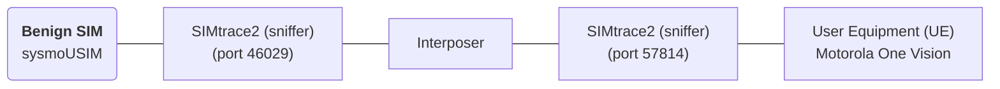
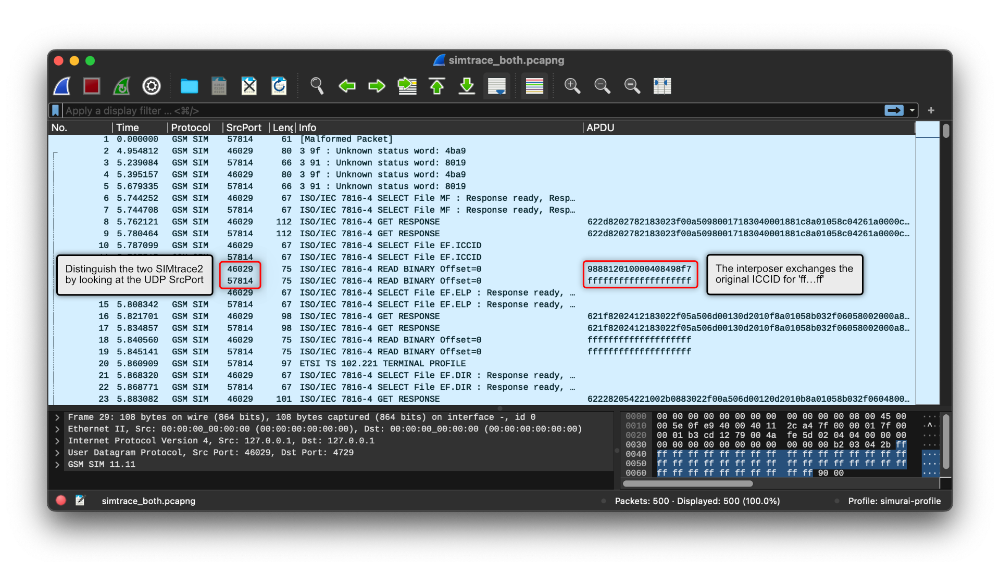

# Description

These artifacts augment the case study `6.3.1 Physical Access: Interposer`.

We show that:
- we use an interposer to manipulate SIM communication, and
- we successfully deliver the crashing payload from the custom firmware.

Please understand that the firmware of the interposer is proprietary, and as it only serves as an example to explore the threat posed by physical attackers, we do not publish details of this particular product.

## Assets
Main asset:
- `simtrace_both.pcapng`: main PCAP file with APDU traces of both SIMtrace2 sniffers.

Additional assets:
- Console output of the `simtrace2-sniff` tool, which contains the same information as the PCAP:
  - `./auxiliary/simtrace_interposer.log`
  -  `./auxiliary/simtrace_sysmoUSIM.log`: 

# Setup

sysmoUSIM:
- ICCID: decoded `8988211000000448897`, encoded: `988812010000408498f7`
- IMSI: decoded `001010000044889`, encoded: `080910100000408498`

## Procedure

The setup is connected as shown in the picture. The procedure for capturing was simple:

1. Simultaneously start the phone and both SIMtrace2 sniffers.
2. During phone startup, the baseband will start reading the SIM, and eventually crash.
3. Wait for the baseband to re-start.

The last step is only to ensure that SIMtrace2 flushes its buffers and writes all relevant packets to the PCAP.

## PCAP Walk-Through

Ensure the Wireshark profile is installed and selected, as described in [`util/wireshark_profile/`](../../util/wireshark_profile/README.md).

The interposer passes most APDUs through without change. Hence, you see most APDUs two times, as both SIMtrace2 record them. You'll see differences whenever the interposer blocks, manipulates, or injects APDUs.

- **Packets 10/11**: the UE selects the `ICCID` file.
- **Packets 12/13**: the interposer exchanges the original ICCID `988812010000408498f7` with `ffffffffffffffffffff`.

This behavior is part of the stock firmware of the interposer, and in our understanding, a component of bypassing carrier-locks.

- **Packets 98/99**: the UE selects the `IMSI` file.
- **Packets 102/103**: the IMSI is passed through without change.

Again, this is part of the stock firmware, and only highlights that the interposer is capable of selectively filtering packets (ICCID vs. IMSI).

Now follows the injection of the crashing payload, through our custom firmware on the interposer.

- **Packet 291/292**: the UE sends a `STATUS` command; an opportunity for the SIM to signal a pending proactive command.
  - The sysmoUSIM (**packet 291**) signals `Status Word: 9000 Normal ending of the command`; in this context, this means that no proactive command is pending.
  - In contrast, our custom interposer firmware (**packet 292**) signals `Status Word: 9109 Normal ending of command with info from proactive SIM`. Hence, in the next packet, the UE will ask the SIM to provide the proactive command.
- **Packet 293**: Our custom interposer firmware injects the crashing payload `FETCH Proactive Command SEND SS`, which causes the baseband to crash.

The crash occurs a few seconds after the command. There is consecutive communication, but we verified that it is precisely this command that causes the crash. This might be due to the baseband's handling of SIM communication.