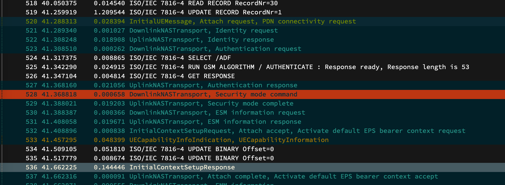
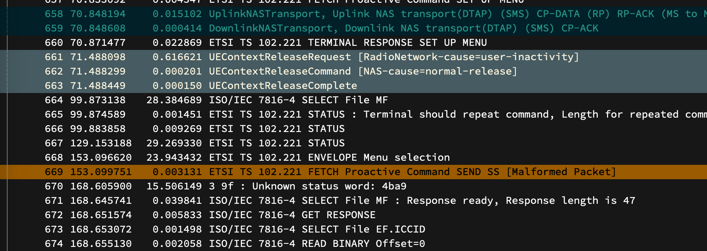

# Description

These artifacts augment the case study `6.3.2 Rogue Carrier: Over-the-Air SIM Card Update`.

We show that:
- SIM applets can be remotely installed without interaction
- we successfully deliver the crashing payload from the applet.

Assets:
- PCAPs:
  - `merged_simtrace_epc.pcapng`: this is the main PCAP file that we discuss in the following; it was merged from `simtrace.pcapng` and `epc.pcap`.
  - `simtrace.pcapng`: SIMtrace2 captured SIM communication
  - `epc.pcap`: NAS-protocol capture at the EPC.
  - `enb_s1ap.pcap`: S1AP-protocol between EPC and eNB.
  - `enb_mac.pcap`: MAC-layer capture at the eNodeB.

Only the NAS-layer and SIM communication is interesting in this context; the other files are supplied for completeness.

- Video:
  - `screenrecording.mp4`: Android screen capture covering initial network attach, applet installation, and payload delivery.

# Setup

It looks a bit messy due to limited space in the shielding box:

# Procedure

1. Locally (with card reader): verify that applet is uninstalled
2. Insert SIM in phone, start the phone. Simultaneously, start SIMtrace2 sniffing.
3. Phone connects to mobile network (srsEPC, srsENB)
4. Trigger sending of the SMS (~20 in total), which contain the APDU payload for installation.
5. Applet is being installed through the SMS (takes a while to process on SIM).
6. Trigger vulnerability through a SIM applet.

The SIM is quite active before and during connection establishment. Triggering SMS and vulnerability delivery manually (i.e., through an on-SIM STK menu) helps to produce a "clean" PCAP where i) network setup, ii) applet installation, and iii) proactive command delivery are clearly separated.

## PCAP Walk-Through

Ensure the Wireshark profile is installed and selected, as described in `util/wireshark_profile/`.

Open `merged.pcapng`, which contains both the SIM communication and NAS-layer communication (originating from EPC). This nicely shows the connection between SMS communication and forwarding of that SMS to the SIM.

### Connection Establishment

Packets 1-519: the UE reads the SIM contents for network configuration.

From packet 519, the UE starts the network establishment.

- Packet 523: the network sends an authentication challenge ("Authentication request").
- Packets 524-526: the challenge is forwarded to and replied by the SIM ("AUTHENTICATE" command).
- Packet 527: the response is sent back to the network in a NAS "Authentication response".

Following that process the smartphone is fully connected to the network from Packet 537 ("Attach complete").

After a couple of seconds, we start the installation of the SIM applet via SMS

- Packet 539: the first SMS is sent to the phone. The phone acknowledges the receipt (Packet 540).
- Packet 541: the SMS wrapped in a `ENVELOPE` command and sent to the SIM card.

This process continues for all chunks of the applet, in a total of ~20 SMS.

- Packet 658: the last chunk is transferred to the SIM; the applet is now installed.

- Packet 660: the SIM instructs the smartphone to open the installed applet ("SET UP MENU"). In our experience, this takes a while for freshly-installed applets. The menu takes ~1 minute to appear.

- Packet 668: we select the menu item that causes the SIM applet to trigger the vulnerability in Packet 645.
- Packet 669: Crashing payload, proactive command `SEND SS`

## Video Notes

- UE starts in flight mode, SIM is still being initialized
- 00:00.25: turning off flight mode, immediately attaches, network shown as "Software Radio Systems" (srsEPC/srsENB)
- 00:00.31: quick look in menu - currently no applet is installed (will later appear in this menu)
- 00:01.07: waiting for the applet to appear
- 00:02.13: applet finally appears in menu (bottom right); open the applet
- 00:02.22: modem crashes ("RIL re-start"), network connection is gone (status bar)
- 00:02.38: network connection comes back

- After a couple of seconds, due to the modem crash, the SIM is read again, and in Packet 1180 a new connection request begins.
